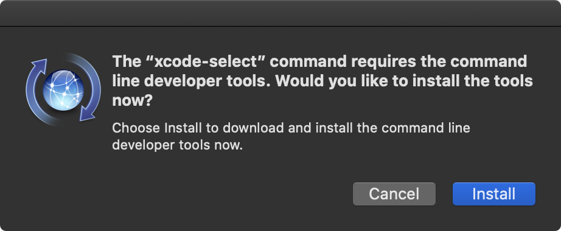

# Reference List

<a name="top"></a>

## TOC

1. [Apple  ](#macintosh)
	1. [Tools](#macos_tools)
	1. [Handy Terminal Commands](#macos_terminal_commands)
	1. [Documentation](#macos_documentation)
	2. [Apple Device Automation](#apple_device_automation)
2. [Unix & GNU/Linux](#unix_linux)
3. [Windows](#windows)
1. [MDM](#mdm)
	1. [Apple](#apple_apns)
	1. [Jamf](#jamf)
	2. [WorkspaceONE](#wso)
	3. [MSFT Azure](#msft_azure)
	3. [Mobile Iron](#MI)
1. [Virtualization](#virtualization)
2. [Google Enterprise](#google_enterprise)
1. [Related to Scripting & Development](#scripting-and-languages)
	1. [Python](#python)
	1. [Swift](#swift_code)
	1. [Bash](#bash)
	1. [Atom](#atom)
	1. [Markdown](#markdown)

---

<a name="macintosh"></a>

## Related to Apple Macintosh Support & Administration

- [HP Printer Driver FTP](ftp://ftp.hp.com/pub/softlib/software12/HP_Quick_Start/osx/Installations/Essentials//)


<a name="macos_tools"></a>
### Tools

- [Packages](http://s.sudre.free.fr/Software/Packages/about.html): Awesome package creator
- [AutoPkg](https://autopkg.github.io/autopkg/)
	- [recipe-robot](https://github.com/homebysix/recipe-robot): help create AutoPkg recipes.
- [Suspicious Package](http://www.mothersruin.com/software/SuspiciousPackage/get.html): look inside of packages. 
- [PPPC Utility (Jamf)](https://github.com/jamf/PPPC-Utility)
- [Profile Creator](https://github.com/ProfileCreator/ProfileCreator)
- [Payload-Free-Package-Creator](https://github.com/rtrouton/Payload-Free-Package-Creator): when you want to just dumb a script somewhere.
- [Google Santa](https://github.com/google/santa): Application blacklisting
- [DEPNotify](https://gitlab.com/Mactroll/DEPNotify): Simple tool to display
    what is happening during DEP enrollment on the Mac.
    - [cannonball](http://cannonball.tombridge.com/2017/04/27/getting-started-with-installapplication-depnotify-and-simplemdm/)
- [SplashBuddy](https://github.com/Shufflepuck/SplashBuddy)
- [ManagedMac](http://dayglojesus.github.io/managedmac/): puppet plugin for managing mac.
- [Dock Master](https://github.com/Error-freeIT/Dock-Master)
- [mas-cli](https://github.com/mas-cli/mas): App Store from the CLI    
- [NoMAD](https://nomad.menu/downloads/ "No More Active Directory"): Active
    Directory broker client. OpenSource alt to Apple's Enterprise Connect
    service
- [AutoDMG](https://github.com/MagerValp/AutoDMG)
- [precache](https://github.com/krypted/precache): Pull updates down top the
    Apple macOS Server Caching service.
- MCXToProfile: convert `.plist` configuration files to `.mobileconfig` files for
    deployment through **Profile Manager**
- Automator
- Apple Configurator2
- [EraseInstall](https://bitbucket.org/prowarehouse-nl/erase-install/src/master/)
- [InstallApplications](https://github.com/erikng/installapplications):
    dynamically download packages for use with `InstallApplication` 
    

### Handy Sites

- [http://www.getmacapps.com](http://www.getmacapps.com)
- [macadmins.software](macadmins.software)
- [https://derflounder.wordpress.com](https://derflounder.wordpress.com)
    

<a name="macos_terminal_commands"></a>    
### Handy Commands

- Show `failedLoginCount` for a user
	
	`dscl . -readpl /Users/<user_name> accountPolicyData failedLoginCount`
	
- Reset `failedLoginCount` setting

	`dscl . -deletepl /Users/<user_name> accountPolicyData failedLoginCount`

- Read & Write Apple language preferences

	`defaults read -g AppleLocale`
	`defaults read -g AppleLanguages`
	`defaults read NSGlobalDomain AppleLanguages`
	`defaults write NSGlobalDomain AppleLanguages "(en-AU)"`
	
	[Retrieving the languages in Terminal](https://developer.apple.com/library/archive/qa/qa1391/_index.html)

- Show all ARP table entries

	`arp -a`

- Force unbind from AD domain

	`sudo dsconfigad -force -remove -u johndoe -p nopasswordhere`
	
- Generate a random UUID

	`uuidgen | tr "[:upper:]" "[:lower:]"`
	
- Sign a package with a developer ID installer cert

	`productsign --sign “Developer ID Installer: Your Developer Name (1A2B3C4D5E)” ~/Desktop/example.pkg ~/Desktop/signed-example.pkg`
	
- Remove GateKeeper restrictions

	`sudo spctl --master-disable`
	
- Clear passcode profile settings
	
	`sudo pwpolicy -clearaccountpolicies`


<a name="macos_documentation"></a>
### Documentation

#### Apple KBs

- [HT201407 - If you can't activate your iPhone](https://support.apple.com/en-us/HT201407)
- [HT208643 - APNS Support Doc](https://support.apple.com/en-us/HT208643)
- [HT201260 - macOS Builds](https://support.apple.com/en-us/HT201260)
- [HT201255 - Mac Startup Cmd Options](https://support.apple.com/en-us/HT201255)
- [HT201853 - Apple Video Adapters and Cables](https://support.apple.com/en-us/HT201853 "About Apple Video Adapters and Cables")


#### Whitepapers

- APNS
	- [Apple Developer - APFS](https://developer.apple.com/library/content/documentation/FileManagement/Conceptual/APFS_Guide/Introduction/Introduction.html#//apple_ref/doc/uid/TP40016999-CH1-DontLinkElementID_19)
	- [Apple Developer - APNS - API](https://developer.apple.com/library/archive/documentation/NetworkingInternet/Conceptual/RemoteNotificationsPG/CommunicatingwithAPNs.html#//apple_ref/doc/uid/TP40008194-CH11-SW1)
	- [Apple Developer - APNS - Overview](https://developer.apple.com/library/archive/documentation/NetworkingInternet/Conceptual/RemoteNotificationsPG/APNSOverview.html#//apple_ref/doc/uid/TP40008194-CH8-SW1)


#### Other

- [Apple Document Style Guide](https://help.apple.com/applestyleguide/#/apsg3acde405)
- [Apple Open Source Documentation](https://opensource.apple.com/)
- [keyboard shortcuts](http://support.apple.com/kb/HT1343 )

- Launchd Documentation
	- `man launchd.plist` - to see a full list of keys available to daemons/agents.
	- ~/Library/LaunchAgents         Per-user agents provided by the user.
	- /Library/LaunchAgents          Per-user agents provided by the administrator.
	- /Library/LaunchDaemons         System-wide daemons provided by the administrator.
	- /System/Library/LaunchAgents   Per-user agents provided by OS X.
	- /System/Library/LaunchDaemons  System-wide daemons provided by OS X.


- [Apple software Restore (ASR)](https://en.wikipedia.org/wiki/Apple_Software_Restore)
- [Disabled Accounts](https://www.jamf.com/jamf-nation/discussions/18243/password-policy-profile-disables-user-account)
- [Setting Printer Options Via CLI](http://www.brunerd.com/blog/2012/03/13/getting-and-setting-ppd-options-via-command-line-for-use-with-lpadmin-in-os-x/)

	

#### MDM Protocol Related

- [Apple MDM Documentation](https://developer.apple.com/library/content/documentation/Miscellaneous/Reference/MobileDeviceManagementProtocolRef/3-MDM_Protocol/MDM_Protocol.html#//apple_ref/doc/uid/TP40017387-CH3-SW2)
- [Configuration Profile Reference](https://developer.apple.com/business/documentation/Configuration-Profile-Reference.pdf)
- [Apple Profile Manager](http://help.apple.com/profilemanager/mac/5.4/#/apd5BD57F16-A2BF-43B9-AB4B-24948FB52C1E)
- [Apple Configurator 2](http://help.apple.com/configurator/mac/2.0/)
- [MacOS Deployment Reference](https://help.apple.com/deployment/macos/#/ior5d40635d0)


#### Networking & Wi-Fi

- [HT210060 - Use Apple products on enterprise networks](https://support.apple.com/en-us/HT210060)
- [HT201999 - About macOS, iOS, and iTunes server host connections and iTunes background processes](https://support.apple.com/en-us/HT201999)
- [Connet to a Wireless Network from CLI](http://osxdaily.com/2011/04/12/connect-wireless-network-command-line/)
- [802.1x](https://www.esecurityplanet.com/views/article.php/3899996/How-to-Use-Enterprise-WiFi-Encryption-and-8021X-in-Mac-OS-X.htm)
- [Port Specifications for Apple Services](https://support.apple.com/en-us/HT202944)


#### Security

- [Sudoers Modification](https://derflounder.wordpress.com/2016/07/11/editing-etcsudoers-to-manage-sudo-rights-for-users-and-groups/)
- PPPC
	- [Derflounder](https://derflounder.wordpress.com/2018/08/31/creating-privacy-preferences-policy-control-profiles-for-macos/)
- Approving KEXTs
	- [Derflounder](https://derflounder.wordpress.com/2018/04/12/whitelisting-third-party-kernel-extensions-using-profiles/)
	- [Vendor KEXT Info](https://docs.google.com/spreadsheets/d/1IWrbE8xiau4rU2mtXYji9vSPWDqb56luh0OhD5XS0AM/edit#gid=0)
- [Making Changes to the authorizationdb](https://derflounder.wordpress.com/2014/02/16/managing-the-authorization-database-in-os-x-mavericks/) 
	- `security authorizationdb read <system.preferences.[preferencez_setting_name>`
	- `security authorizationdb read referenced.rights > /path/to/filename.plist`
	- `security authorizationdb write system.preferences allow`
	- `security authorizationdb write system.preferences.startupdisk allow`

- The `security` command

	- Find a specific keychain item by name

		`security find-generic-password -l Hermes`


#### Encryption & FileVault

- [Manage FileVault with `fdesetup`](https://derflounder.wordpress.com/2015/12/20/managing-el-capitans-filevault-2-with-fdesetup/)
- [FileVault Institutional Recovery Keys - DerFlounder](https://derflounder.wordpress.com/2014/08/13/filevault-2-institutional-recovery-keys-creation-deployment-and-use/)


<a name="apple_device_automation"></a>
### Automation

- [ConfigAutomation](https://configautomation.com/)  
    - [Supervision Identities](https://configautomation.com/identity-files.html)
    - [APU Doc](https://configautomation.com/apu)
- IPSW Download location
	`$HOME/Library/Group\ Containers/K36BKF7T3D.group.com.apple.configurator/Library/Caches/Downloads/ACUDownloadFileOperation/`
	`$HOME/Library/Group\ Containers/K36BKF7T3D.group.com.apple.configurator/Library/Caches/Firmware/`


### Support

- [ABM Support Numbers](https://help.apple.com/businessmanager/?lang=en-us#/apd098f3d709)
- [Check Apple Services](https://www.apple.com/support/systemstatus/)


\[[top](#top)]

<a name="unix_linux"></a>

## Unix & GNU/Linux

-   [Sane scanner](https://wiki.archlinux.org/index.php/SANE)
-   [Linux Journey](https://linuxjourney.com/lesson/etc-group-file)
-   netboot.xyz
-   Banking with a live cd: <http://krebsonsecurity.com/2012/07/banking-on-a-live-cd/>
-   SSH Tricks: <http://www.linuxjournal.com/article/6602>
-   Rsync command examples - <http://www.thegeekstuff.com/2010/09/rsync-command-examples/>
-   POSIX - <https://en.wikipedia.org/wiki/POSIX>
-   Security Enhanced Linux: <http://selinuxproject.org/page/Main_Page>
-   Cool old terminal - old looking terminal for linux: <http://linuxg.net/how-to-install-cool-old-term-0-9-on-ubuntu-14-04-debian-jessie>


### ZSH

- Change the keybindings back to EMACS by adding the following to `.zshrc`

	`bindkey -e`

\[[top](#top)]


## Related to Windows Administration

- [sway.office.com](https://sway.office.com/leB5lmZDQsxnrMAv?ref=Link)
- List of WMIC CSProduct Get Name Results - <http://faqshop.com/misc/list-of-wmic-csproduct-get-name-results/>
- [Troubleshooting Slow Logons via PowerShell](https://www.citrix.com/blogs/2015/08/05/troubleshooting-slow-logons-via-powershell/)
- [Logon GPO Analysis via PowerShell](https://www.controlup.com/blog/logon-gpo-analysis-via-powershell/)
- [Windows 10 Environment Variables](https://www.tenforums.com/tutorials/3234-environment-variables-windows-10-a.html)
- [Install RSAT - Win10 1809](https://www.prajwaldesai.com/install-rsat-tools-on-windows-10-version-1809/)


### Tools

- [Windows ISO Downloader](https://heidoc.net/joomla/technology-science/microsoft/67-microsoft-windows-and-office-iso-download-tool)
- [GPO Migration Tool](https://code.vmware.com/samples/3527/airwatch-gpo-migration-tool?h=gpo%20migration%20tool)


### MSFT Office

- [Change Native Language](https://www.jamf.com/jamf-nation/discussions/25722/changing-languages-in-office-2016)

	```shell
	defaults write com.microsoft.Excel AppleLanguages ‘(“ES”)’
	defaults write com.microsoft.Powerpoint AppleLanguages ‘(“ES”)’
	defaults write com.microsoft.Word AppleLanguages ‘(“ES”)’
	```
	
- [macadmins.software](https://macadmins.software)
	- [Outlook Preferences](https://docs.microsoft.com/en-us/DeployOffice/mac/preferences-outlook)
	- [OneDrive Preferences](https://docs.microsoft.com/en-us/onedrive/deploy-and-configure-on-macos)
- [Mac Office 2011 Rem Tool](https://github.com/pbowden-msft/Remove2011/blob/master/Remove2011)
- [Office One-click login - Jamf](https://www.jamf.com/blog/help-users-activate-microsoft-office-365-and-configure-outlook-in-one-click/)
- [MacOS Word Keyboard Shortcuts](https://support.office.com/en-us/article/Keyboard-shortcuts-in-Word-for-Mac-3256d48a-7967-475d-be81-a6e3e1284b25)
	- Page Break - `⌘ + Return`
	- Paste and Match Style - `⌘ + ⌥ + ⇧ + V`
- [MacOS Excel Keyboard Shortcuts](https://support.office.com/en-us/article/Keyboard-shortcuts-in-Excel-for-Mac-acf5419e-1f87-444d-962f-4e951a658ccd)
	- AutoFit Width - `⌥ + H + O + I` - in sequence. Not at the same time
	- AutoFit Height - `⌥ + H + O + A` - in sequence. Not at the same time

### Active Directory/AzureAD/LDAP

- Objects
	- CN = Common Name
	- OU = Organizational Unit
	- DC = Domain Component
- Example Search Criteria
	- ("CN=Dev-India,OU=Distribution Groups,DC=gp,DC=gl,DC=google,DC=com");


#### AzureAD

- Password Hash Synchronization with AzureAD

	- [What is password hash synchronization with Azure AD?](https://docs.microsoft.com/en-us/azure/active-directory/hybrid/whatis-phs)
	- [What is federation with Azure AD?](https://docs.microsoft.com/en-us/azure/active-directory/hybrid/whatis-fed)

- [AzureADv1 Error Codes](https://docs.microsoft.com/en-us/azure/active-directory/develop/reference-aadsts-error-codes)
- [AzureADv2 Error Codes](https://docs.microsoft.com/en-us/azure/active-directory/develop/reference-aadsts-error-codes)


### OIDC & Microsoft Identity Platform

- [Identity Platform](https://docs.microsoft.com/en-us/azure/active-directory/develop/about-microsoft-identity-platform)
	- [2.0](https://docs.microsoft.com/en-us/azure/active-directory/develop/v2-overview)
- [Microsoft identity platform and OpenID Connect protocol](https://docs.microsoft.com/en-us/azure/active-directory/develop/v2-protocols-oidc)


\[[top](#top)]

### SCCM Administration

-   [SCCM Queries with PowerShell](http://blog.ctglobalservices.com/powershell/kaj/working-with-queries-in-configmgr-with-powershell/)

-   [WMI SCCM Queries](https://www.andersrodland.com/ultimate-sccm-querie-collection-list/)

-   Convert from BIOS to UEFI Using SCCM - <https://www.systemcenterdudes.com/sccm-bios-uefi-conversion-task-sequence>

    -   Another Article regarding Bios to UEFI conversion - <https://docs.microsoft.com/en-us/sccm/osd/deploy-use/task-sequence-steps-to-manage-bios-to-uefi-conversion>

-   Deploy Windows from Captured Media -  <https://blogs.technet.microsoft.com/configurationmgr/2010/04/12/how-to-set-up-a-task-sequence-to-deploy-windows-7-images-captured-via-an-sccm-2007-capture-cd/>

-   Driver management - <https://technet.microsoft.com/en-us/library/hh301101.aspx>


### Image Creation

- [ngen.exe](https://docs.microsoft.com/en-us/dotnet/framework/tools/ngen-exe-native-image-generator)
- [DISM](https://docs.microsoft.com/en-us/windows-hardware/manufacture/desktop/what-is-dism)
- [Win10 Sysprep](https://theitbros.com/sysprep-windows-10-machine-guide/)
- [cleanmgr.exe](https://support.microsoft.com/en-us/help/253597/automating-disk-cleanup-tool-in-windows)
- [Sdelete Tool](https://docs.microsoft.com/en-us/sysinternals/downloads/sdelete)
- [OS Optimization Tool](https://labs.vmware.com/flings/vmware-os-optimization-tool)


### Handy Commands

- Get windows version

	`systeminfo | findstr /B /C:"OS Name" /C:"OS Version"`
	

- Import a Root Cert into Local Trusted CAs

	1. Download and save the certificate.
	1. Open the Certificate Manager
	1. Hit Windows+R, or click on the Blue Vista icon in the lower left hand corner
	1. In the "Start Search" box, type "certmgr.msc" (no quotes).
	1. The certificate manager will open.
	1. Right click on "Trusted Root Certification Authorities" from the folder list on the left.
	1. In the pop-up menu, choose "All Tasks" >> "Import.."
	1. Click the "Next" button
	1. Click the "Browse" button
	1. Browse to the location where the certificate is saved, click on it then click the "Open" button
	1. Click the "Next" button
	1. Select "Place all certificates in the following store"
	1. Click the "Browse" button
	1. Put a checkmark beside "Show physical stores"
	1. Expand the "Trusted Root Certification Authorities" folder
	1. Click "Local Computer"
	1. Click the "OK" button.
	1. Click the "Next" button
	1. Click the "Finish" button


### Error Codes

- 0x80070422 - restart the windows update service
- The trust relationship between this workstation and the primary domain failed.
	- Un Bind/Bind

\[[top](#top)]


<a name="mdm"></a>

## MDM

<a name="apple_apns"></a>
### Apple

- [MacOS WiFi Login Window Profile]( https://ntsystems.it/post/joining-wifi-before-login-on-mac-os-x-108)
- APNS URI (Jamf --> Apple APNS)
	- api.push.apple.com | 443
	- feedback.push.apple.com* | 2196
- APNS URI (Mac Client --> Apple APNS)
	- courier.push.apple.com | 5223
	- [APNS Under the Hood](https://www.youtube.com/watch?v=E39aYd2RMdE&t=1568s)
	- 17.0.0.0/8:5223
- Additional FQDNs
	- albert.apple.com
	- iprofiles.apple.com
	- *.symcb.com
	- evintl-ocsp.verisign.com
	- evsecurer-oscp.verisign.com
- [Set a Policy Banner at Login Window](https://support.apple.com/en-us/HT202277)


#### DEP Debug

https://jamf.it/dep-debug

1. Start up the freshly-wiped Mac into single-user mode: at boot hold down CMD + S
1. Mount the boot drive as read/write: /sbin/mount -uw /
1. Enable opendirectory:
1. launchctl load /System/Library/LaunchDaemons/com.apple.opendirectoryd.plist
1. Ignore the error that is thrown and click Enter
1. Enable root password: passwd root
1. Reboot: reboot
1. When Setup Assistant is up but we haven’t yet advanced to the Remote Management pane, launch Terminal by clicking CTL + OPTION + CMD + T, then run the following:

	```bash
	su root 
	defaults write /Library/Preferences/com.apple.apsd EnableDetailedLogging -bool TRUE
	defaults write /Library/Preferences/com.apple.MCXDebug debugOutput -2
	defaults write /Library/Preferences/com.apple.MCXDebug collateLogs 1
	touch /var/db/MDM_EnableDebug
	```

1. Run the Mac through the DEP prestage enrollment as normal, once booted to the Desktop, we should find the log written to: /Library/Logs/ManagedClient/ManagedClient.log


<a name="jamf"></a> 
### Jamf

*API Documentation*

- [API Support](http://developer.jamf.com/apis/jamf-pro-api/index)
- [New Swagger API - https://[your_url].jamfcloud.com/uapi/doc](https://[your_url].jamfcloud.com/uapi/doc/#)
- What can be manipulated
	- Enbale/disable Bluetooth


*Maintenance URLs*

- [Service Status](status.jamf.com)


*Network Information*

- [Ports Used](https://www.jamf.com/jamf-nation/articles/34/network-ports-used-by-jamf-pro)
- [JamfCloud IP Addresses](https://www.jamf.com/jamf-nation/articles/409/permitting-inbound-outbound-traffic-with-jamf-cloud)


*Infrastructure*

- [JIM Install Guide](http://docs.jamf.com/infrastructure-manager/1.3.2/Installing_a_Jamf_Infrastructure_Manager_Instance.html)
- [AzureAD LDAPS](https://www.jamf.com/jamf-nation/discussions/25876/a-guide-to-jss-azure-ad-integration-ldap-+-sso)
- [AzureAD Integration](https://marketplace.jamf.com/details/azure-active-directory/)
- [Okta LDAP Integration](https://travellingtechguy.eu/integrating-okta-ldap-in-jamf-pro/)


*Single-Sign-On*

- [Single Sign-On](http://docs.jamf.com/10.10.0/jamf-pro/administrator-guide/Single_Sign-On.html)
	- [Okta](https://www.jamf.com/jamf-nation/articles/435/configuring-single-sign-on-with-okta)
	- [ADFS](https://www.jamf.com/jamf-nation/articles/436/)
	- [Shibboleth](https://www.jamf.com/jamf-nation/articles/437/)
	- [OneLogin](https://www.jamf.com/jamf-nation/articles/438/)
	- [Ping Identity](https://www.jamf.com/jamf-nation/articles/439/)
	- [G-Suite](https://www.jamf.com/jamf-nation/articles/440/)


*Conditional Access*

- [Intune Integration - Traveling Tech Guy](https://travellingtechguy.eu/jamf-pro-and-ms-azure-intune-for-macos/)
- [Jamf Pro Admin Guide - 10.15 - Intune integration](https://docs.jamf.com/10.15.0/jamf-pro/administrator-guide/Integrating_with_Microsoft_Intune.html)
- [Conditional Access with Azure](https://resources.jamf.com/documents/white-papers/conditional-access-going-beyond-perimeter-based-security.pdf)


*SCEP Proxy Configuration*

- Port 443 or 80
- [Enabling SCEP in Jamf Pro](https://docs.jamf.com/technical-papers/jamf-pro/scep-proxy/10.0.0/Enabling_Jamf_Pro_as_SCEP_Proxy_for_Configuration_Profiles.html)
- [Jamf Pro SCEP Communication](https://www.jamf.com/jamf-nation/articles/488/communication-of-jamf-pro-as-scep-proxy)
- [Obtaining a SCEP Proxy Signing Certificate from a Microsoft CA Using Terminal and Uploading the Certificate to Jamf Pro](https://www.jamf.com/jamf-nation/articles/538/obtaining-a-scep-proxy-signing-certificate-from-a-microsoft-ca-using-terminal-and-uploading-the-certificate-to-jamf-pro) - using an external SCEP cert during device enrollment.
- [Video on Setting up Jamf as a SCEP Proxy](https://www.youtube.com/watch?v=jn0HTWKubFY)
- [SCEP - Microsoft CA Integration](https://www.ibm.com/support/knowledgecenter/en/SS8H2S/com.ibm.mc.doc/ce_source/concepts/ce_ca_ms_ca_int.htm)


*Misc Documentation*

- [All Product Documentation](https://www.jamf.com/resources/product-documentation/)
- [Jamf Pro Security Overview](https://www.jamf.com/resources/product-documentation/jamf-pro-security-overview/)
- [MacOS Security Checklist](https://resources.jamf.com/documents/products/documentation/macos-security-checklist.pdf)

*Errors*

- 


#### Packaging

- [Re-packaging Installer Packages](https://derflounder.wordpress.com/2013/11/03/re-packaging-installer-packages-with-packages/)
- [Package Management](https://docs.jamf.com/10.9.0/jamf-pro/administrator-guide/Managing_Packages.html)


#### Tools

- [GitHub](https://github.com/jamf)
	- [DEPNotify-Starter](https://github.com/jamf/DEPNotify-Starter)
- [Jamf Connect](https://www.jamf.com/resources/product-documentation/jamf-connect-administrators-guide/)
	- Licensing
		- Jamf Connect Verify preferences
		- A .jamfconnectlicense file in /Library/Application Support/com.jamf.connect.verify
		- A .jamfconnectlicense file in ~/Library/Application Support/com.jamf.connect.verify
		- Note: To store the license in the preferences configuration profile, you must convert the license file to base64 format, and then use the LicenseFile key in your configuration profile.
- [NoMAD Helper](https://www.youtube.com/watch?v=fQ4Epy1J7ZU)
- [Composer User Guide](https://www.jamf.com/resources/product-documentation/composer-user-guide/)


<a name=“wso”></a>
### Workspace ONE

- [Airwatch Samples](https://github.com/vmware-samples/AirWatch-samples/tree/master/Windows-Samples/Sensors)
- [AirWatch Learning Path](https://mylearn.vmware.com/mgrReg/plan.cfm?plan=47955&ui=www_edu)
- [MacOS Profile Guide](https://my.air-watch.com/help/9.1/en/Content/Platform_Guides/macOS/C/Profiles_Overview.htm?TocPath=PROFILES|macOS%C2%A0Device%20Profiles|_____0)
- [Documentation](https://resources.air-watch.com/documentation?sort=newest)
- [Munki Integration](https://support.air-watch.com/articles/360000721788)
    - [Munki teardown](http://www.aarondavidpolley.com/vmware-airwatch-munki-teardown/)
- [AW REST APIs]()
	- [Get devices from AW](https://macadminsdoc.readthedocs.io/en/master/MDM/AirWatch/AirWatch-API.html)
	- your_console.com/api/help
	- Reserved REST Chars
		- Reserved: & ( ) {} [] " <>
		- Allowed: ! @ $ % ^ *  - + | \ ' ?
- [MacOS](https://my.air-watch.com/help/9.1/en/Content/Platform_Guides/macOS/C/Profiles_Overview.htm?TocPath=PROFILES|macOS%C2%A0Device%20Profiles|_____0)
- [vSphere SDK - Python](https://github.com/vmware/vsphere-automation-sdk-python/blob/master/README.md)
- [VMware Code](https://code.vmware.com/home)

#### Documentation

- [Workspace ONE UEM Docs](https://docs.vmware.com/en/VMware-Workspace-ONE-UEM/1907/rn/VMware-Workspace-ONE-UEM-Release-Notes-1907.html)
- [Device Profiles](https://docs.vmware.com/en/VMware-Workspace-ONE-UEM/1908/iOS_Platform/GUID-AWT-IOS-PROFILE-OVERVIEW.html)
	- [Windows](https://docs.vmware.com/en/VMware-Workspace-ONE-UEM/1908/Windows_Desktop_Device_Management/GUID-AWT-PROFILE-OVERVIEWWD.html)

#### Tools

- [Workspace ONE Validation Analyzer](https://docs.vmware.com/en/VMware-Workspace-ONE-UEM/9.4/vmware-airwatch-guides-94/GUID-AW94-ValidationTool.html)
- [Workspace ONE Provisioning Tool](https://labs.vmware.com/flings/vmware-workspace-one-provisioning-tool)


<a name=“msft_azure”></a>
### MSFT Azure

- [REST API](https://docs.microsoft.com/en-us/rest/api/azure/)

<a name=“MI”></a>
### Mobile Iron

- 

\[[top](#top)]
<a name="virtualization"></a>

## Virtualization

-	[VDI Design Guide](https://vhojan.nl/category/vdi-design-guide/) | Johan van Amersfoort
- 	[Desktop as a Service: Everything you need to know about DaaS and hosted VDI](https://www.amazon.com/gp/product/0985217421/ref=ox_sc_act_title_2?smid=ATVPDKIKX0DER&psc=1) | Brian Madden
-	[VMware vSphere 6.5 Hosted Resources Deep Dive](https://www.amazon.com/gp/product/1540873064/ref=ox_sc_act_title_3?smid=ATVPDKIKX0DER&psc=1) | Frank Denneman


### VMware WSO Identity Manager


- [Product Documentation vIDM](https://docs.vmware.com/en/VMware-Identity-Manager/index.html)
- [Carl Stalhood | IDM 19.03 Walkthrough](https://www.carlstalhood.com/vmware-identity-manager/)
- [Upload a New Certificate Authority for SAML Signing Certificates](https://docs.vmware.com/en/VMware-AirWatch/9.1/com.vmware.idm-administrator_aw91/GUID-A31EDEF9-5819-4C06-9A91-6E3F67566A39.html)


#### Identity Manager Connector

- [Identity Manager Deployment v3.3](https://docs.vmware.com/en/VMware-Identity-Manager/3.3/com.vmware.vidm-dmz-deployment/GUID-570583AB-1B77-422F-9916-CB2337EE6140.html)
- [Enable Outbound Mode for the Connector](https://docs.vmware.com/en/VMware-Identity-Manager/3.3/com.vmware.vidm-dmz-deployment/GUID-C97A4D37-8F1F-4B24-9A97-1A25A0033999.html)

#### Troubleshooting

- Health API Endpoints for vIDM and On-Prmise implementations respectively.

	`https://<idM_SERVER_NAME>/hc/API/1.0/REST/system/health?pretty`
	`https:/</idm_server_name>/SAAS/API/1.0/REST/system/health`

### VMware Horizon

- [Horizon 7 Documentation](https://docs.vmware.com/en/VMware-Horizon-7/index.html)
	- [Architecture Planning - v7-7.8](https://docs.vmware.com/en/VMware-Horizon-7/7.8/horizon-architecture-planning.pdf)
	- [Hardware Requirements](https://docs.vmware.com/en/VMware-Horizon-7/7.9/horizon-installation/GUID-332CFB83-784A-4578-9354-888C0538909A.html)
- Carl Stalhood - [www.carlstalhood.com/](http://www.carlstalhood.com/)
	- [7.7-8 - Installation](https://www.carlstalhood.com/vmware-horizon-7-configuration/#vcenter)
- 50 Articles to fix everything - https://blogs.vmware.com/kb/2015/03/50-kbs-fix-everything-horizon-view.html
- [WorkspaceONE Horizon Reference Arch](https://techzone.vmware.com/resource/workspace-one-and-horizon-reference-architecture#horizon-seven-vmware-identity-manager-integration)
- [Understanding Horizon Connections - Blog](https://techzone.vmware.com/blog/understanding-horizon-connections)
- Cloud Connector Virtual Appliance - 7-7.8
	- [Deployment](https://docs.vmware.com/en/VMware-Horizon-7/7.8/horizon-installation/GUID-973234D9-000A-4732-957A-CA8BEA3D5D24.html)

	
#### Horizon Agent

- [Supported versions of Windows 10 on Horizon Agent Including All VDI Clones (Full Clones, Instant Clones, and Linked Clones on Horizon 7) (2149393)](https://kb.vmware.com/s/article/2149393)
- [Configure Realtime Audio Video](https://docs.vmware.com/en/VMware-Horizon-7/7.6/horizon-remote-desktop-features/GUID-0923B4C2-16C7-4C45-BD6E-945858518798.html)

#### Login Portals

- https://cloud.horizon.vmware.com/login


#### Certificate Information

- [Build a Concatenated PEM File](https://kb.vmware.com/s/article/2046591)
	- IDM Server PEM Cert

- [Convert Certificate Files to One-Line PEM Format](https://docs.vmware.com/en/Unified-Access-Gateway/3.3.1/com.vmware.uag-331-deploy-config.doc/GUID-870AF51F-AB37-4D6C-B9F5-4BFEB18F11E9.html#GUID-870AF51F-AB37-4D6C-B9F5-4BFEB18F11E9)
	- UAG SAML file signing
	- IdM Appliance SAML Cert
	- vRealize

	`cat server_cert.cer key_filename.key cacerts.cer > multi_part.pem`


#### Upgrading

- [Horizon 7-7.8 Upgrade Documentation](https://docs.vmware.com/en/VMware-Horizon-7/7.8/horizon-upgrades/GUID-E3607442-8936-49A8-97B4-722D012FDF1E.html)


#### vSphere (ESXi) Server

- [Install and Setup - ESXi 6.7](https://docs.vmware.com/en/VMware-vSphere/6.7/vsphere-esxi-671-installation-setup-guide.pdf)
- [Install ESXi 6.7 on Workstation, VirtualBox, and Bare Metal](https://www.sysnettechsolutions.com/en/vmware/install-vmware-esxi-6-7/)
- [Adding vSphere CA Cert](https://www.techazine.com/2017/09/22/an-easy-fix-for-vsphere-6-5-web-client-and-certificates-to-keep-your-uploads-flowing/)
- [Import the VCSA Self-Signed Cert](https://tinkertry.com/how-to-get-rid-of-vsphere-browser-certificate-warnings-in-windows)


#### vCenter Server

- [Install and Setup - vCenter 6.7](https://docs.vmware.com/en/VMware-vSphere/6.7/vsphere-vcenter-server-671-installation-guide.pdf)
- [vCenter User Privilege Requirements - 7.7-8](https://docs.vmware.com/en/VMware-Horizon-7/7.8/horizon-installation/GUID-A878F876-B359-42FC-9124-A1E34BFB3319.html)
- VCSA Sysprep file location
	- `/etc/vmware-vpx/sysprep/`
		- https://kb.vmware.com/s/article/1005593
- [Trust the VSCA Cert](https://tinkertry.com/how-to-get-rid-of-vsphere-browser-certificate-warnings-in-windows)


*Linked Clones*

- [Linked Clone Worksheet - Horizon 7.8](https://docs.vmware.com/en/VMware-Horizon-7/7.8/horizon-console-administration/GUID-F336E9DA-EC69-440A-A1B8-28E4FDC1784B.html)


*Configuration Specifications*

- [Create a Customization Specification for Windows](https://docs.vmware.com/en/VMware-vSphere/6.7/com.vmware.vsphere.vm_admin.doc/GUID-CAEB6A70-D1CF-446E-BC64-EC42CDB47117.html?hWord=N4IghgNiBcKEQEACA4gVwKYGcAuCDCLsB7AWwEsAvMLUwgOwQHcKwAnAExAF8g)
- [Guest Operating System Customization Requirements](https://docs.vmware.com/en/VMware-vSphere/6.7/com.vmware.vsphere.vm_admin.doc/GUID-E63B6FAA-8D35-428D-B40C-744769845906.html#GUID-E63B6FAA-8D35-428D-B40C-744769845906)

*Master VM Creation*

- [Creating an Optimized Windows Image for a VMware Horizon Virtual Desktop](https://techzone.vmware.com/creating-optimized-windows-image-vmware-horizon-virtual-desktop#934148)

*Handy Commands*

- VMware has an easy way of retrieving logs both on the connection servers and the virtual machine.
The command to collect the logs from a remote machine is:
	
	```
	vdmadmin -A -getDCT -outfile file_name.zip -d pool_name -m virtual_machine_name
	```

#### Unified Access Gateway

- [VMware Doc: Deploying and Configuring VMware Unified Access Gateway 3.6](https://docs.vmware.com/en/Unified-Access-Gateway/3.6/com.vmware.uag-36-deploy-config.doc/GUID-F5CE0D5E-BE85-4FA5-BBCF-0F86C9AB8A70.html)
- [UAG 3.6 - Carl Stalhood](https://www.carlstalhood.com/vmware-unified-access-gateway/)
- [UAG 3.5 - Carl Stalhood](https://www.carlstalhood.com/vmware-unified-access-gateway/)
- [Replace the Default TLS/SSL Server Certificate for Unified Access Gateway](https://docs.vmware.com/en/Unified-Access-Gateway/3.1/com.vmware.uag-31-deploy-config.doc/GUID-EDC244DD-07AB-4841-A893-84ADF8D59838.html)
- [UAG SAML Metadata File](https://docs.vmware.com/en/Unified-Access-Gateway/3.3.1/com.vmware.uag-331-deploy-config.doc/GUID-2A689F41-0A6A-4F41-A898-C286DFD70C85.html)
- [UAG Multiple NICs](https://communities.vmware.com/docs/DOC-32926)
- [Load Balancing](https://communities.vmware.com/docs/DOC-32792)


*Troubleshooting*

- [Connection Problems Between Horizon Client and the PCoIP Secure Gateway](https://docs.vmware.com/en/VMware-Horizon-7/7.8/horizon-virtual-desktops/GUID-5117AC00-79FC-4A74-8234-014C157A17F6.html)

#### View Connection Server

- [Installation Pre Requisites - Horizon 7-7.8](https://docs.vmware.com/en/VMware-Horizon-7/7.8/horizon-installation/GUID-68621B8E-F018-4BC4-811A-5CF76B55DB2C.html)
- [Installation - Carl Stalhood](https://www.carlstalhood.com/vmware-horizon-7-connection-server/)
	- Does require load balancing for multiple View Connection Servers
- Hardware
	- 4 CPUs
	- 10 GB MEM
	- 100 GB Disk
- Connections
	- Horizon 7.2 and newer: 4000 connections
	- Horizon 7.1 <= x < 7.2: 2000 connections
- [Creating Single-User Desktop Pools](https://techzone.vmware.com/quick-start-tutorial-series-vmware-horizon-7/creating-single-user-desktop-pools#915877)
- [Allow HTML Access Through a Gateway](https://docs.vmware.com/en/VMware-Horizon-7/7.8/horizon-installation/GUID-FE26A9DE-E344-42EC-A1EE-E1389299B793.html?hWord=N4IghgNiBcIQ9gYwNYFMAmA6ADgJ3tqrgC4CWqAzgAQDmYxqA7mAJ4gC+QA)  

	Connection Server instances and security servers that are directly behind a gateway, such as Access Point, must know the address by which browsers will connect to the gateway when users use HTML Access.

	For Connection Server instances and security servers that are behind a load-balancer or load-balanced gateway, perform the procedure described in [Allow HTML Access Through a Load Balancer](https://docs.vmware.com/en/VMware-Horizon-7/7.8/horizon-installation/GUID-BFF2E726-A5EB-4105-A0EA-F3D718C5880E.html#GUID-BFF2E726-A5EB-4105-A0EA-F3D718C5880E).
	
	1. Go to the following directory: `C:\Program Files\VMware\VMware View\Server\sslgateway\conf\`
	1.	Create the following document in this location `locked.properties`.
	2.	Add the `checkOrigin=false` property and add the address of the UAG similar to the below.
	3.	Restart the Connection server service.

- [Modify the listed domains in Horizon Console, HTML Access, and Horizon Client](https://docs.vmware.com/en/VMware-Horizon-7/7.8/horizon-administration/GUID-3E9924EC-1554-43E5-A812-84F9711909A5.html)

	Make sure to either launch PowerShell as an admin or pass credentials with the `-b` flag.

	- List the domain configuration  
		`vdmadmin -N -domains -list`
	
	- Add a domain to the include list
		`vdmadmin -N -domains -include -domain <your_domain> -add`
		
	- `-s conn_server` Specifies that the operation applies to the domain filters on a Connection Server instance. You can specify the Connection Server instance by its name or IP address.

		If you do not specify this option, any change that you make to the search configuration applies to all Connection Server instances in the group.
		
	- Make sure to go back into the Horizon Admin (Console) and enable the check box `Send Domain List` under **View Configuration > Global Settings > General**
		- This option will not show up if at least one domain is not in the list.
- VDI Machine Naming
	- [Provide a List of names and user assignments](https://docs.vmware.com/en/VMware-Horizon-7/7.8/horizon-virtual-desktops/GUID-F9A7022F-6CB0-482E-9D72-C912F117C240.html)

*Desktop Pools*

- [Carl Stalhood - VMware Horizon 7 – Virtual Desktop Pools](https://www.carlstalhood.com/vmware-horizon-7-virtual-desktop-pools/)
- [Pool Creation - Carl Stalhood](https://www.carlstalhood.com/vmware-horizon-7-virtual-desktop-pools/#prep)

*Errors*

- [Accessing the Horizon View Administrator page displays a blank error window in Horizon 7 (2144768)](https://kb.vmware.com/s/article/2144768)

#### Database Information

- [Configuring Event Reporting - v7-7.9](https://docs.vmware.com/en/VMware-Horizon-7/7.9/horizon-installation/GUID-1E63A836-7B3D-4876-AD9A-4553955E3834.html)
- [Create the ViewEvent Database - Horizon 7.7-8](https://www.virtuallyboring.com/vmware-horizon-view-7-create-events-database/)


#### Persona Management 

- [Configuring a Horizon Persona Management Deployment](https://docs.vmware.com/en/VMware-Horizon-7/7.8/horizon-virtual-desktops/GUID-E9411421-EE62-4870-98CA-ADEE7B70EB32.html)
- [Best Practices for Configuring a Horizon Persona Management Deployment](https://docs.vmware.com/en/VMware-Horizon-7/7.8/horizon-virtual-desktops/GUID-574E2280-E796-4946-8CE4-6617683B5BE3.html)
- [Providing User Personas in Horizon 7 - Horizon 7.8](https://docs.vmware.com/en/VMware-Horizon-7/7.8/horizon-virtual-desktops/GUID-F9F1320A-F6BC-4120-8A8D-2D5F73F79335.html)
- [Using Horizon Persona Management to Retain User Data and Settings - Horizon 7 7.8](https://docs.vmware.com/en/VMware-Horizon-7/7.8/horizon-architecture-planning/GUID-05B1BE12-8DD2-4EAE-A3E2-B52CDB6DFC32.html)
- [Horizon Persona Management and Windows Roaming Profiles](https://docs.vmware.com/en/VMware-Horizon-7/7.8/horizon-virtual-desktops/GUID-E158A9D4-5FCD-4A61-B987-D01622A96FBF.html)


#### View Composer

*View Composer Database*

- [Prepare View Composer DB](https://docs.vmware.com/en/VMware-Horizon-7/7.0/com.vmware.horizon-view.installation.doc/GUID-4CF63F93-8AEC-4840-9EEF-2D60F3E6C6D1.html)
- [Event DB Sizing](http://myvirtualcloud.net/vmware-view-database-sizing/)


#### vSAN

- [Design and Sizing - 2014](https://www.vmware.com/content/dam/digitalmarketing/vmware/en/pdf/whitepaper/products/vsan/vmw-tmd-virt-san-dsn-szing-guid-horizon-view-white-paper.pdf)


#### Active Directory

- [Preparing AD for Horizon - Horizon 7.8](https://docs.vmware.com/en/VMware-Horizon-7/7.8/horizon-installation/GUID-F6075DF0-9614-4A81-B27A-7EE7C4CCB46F.html)
- [Accounts and Permissions - Horizon 7](https://thevirtualhorizon.com/2016/08/08/horizon-7-0-part-6-service-accounts-and-databases/)


#### Tools

- [OS Optimization Tool](https://labs.vmware.com/flings/vmware-os-optimization-tool)
- [Horizon 7 Component Installers](https://my.vmware.com/web/vmware/info?slug=desktop_end_user_computing/vmware_horizon/7_0)
- [ESXi Configuration Maximums](https://kb.vmware.com/s/article/1003497)
- [Health Analyzer](https://vmware.my.salesforce.com/apex/page?name=sales.services.software.solutions)
- [Interoperability Matrix](https://www.vmware.com/resources/compatibility/sim/interop_matrix.php)
- [Digital Workspace Topology Tool](https://tools.techzone.vmware.com/static/topology/index.html#result)
	- [Blog Post](https://blogs.vmware.com/euc/2019/02/introducing-the-vmware-digital-workspace-topology-tool.html?src=so_5a314d05e49f5&cid=70134000001SkJn)
- [Digital Workspace Designer](https://code.vmware.com/group/dp/dwdesigner#)


#### User Information

- [Horizon 7 User Accounts - 7-7.8](https://docs.vmware.com/en/VMware-Horizon-7/7.8/horizon-security/GUID-7C94B12F-0158-42EB-A011-00CC4912A435.html)
- [vCenter Server User for Horizon 7 and View Composer - 7.8](https://docs.vmware.com/en/VMware-Horizon-7/7.8/horizon-installation/GUID-80D653FA-BCC0-45B9-AF84-5E0EEC2AD139.html)
	- [vCenter Server Role Permissions - 7-7.8](https://docs.vmware.com/en/VMware-Horizon-7/7.8/horizon-installation/GUID-A878F876-B359-42FC-9124-A1E34BFB3319.html#GUID-A878F876-B359-42FC-9124-A1E34BFB3319)
- [View Composer and Instant Clone Privileges Required for the vCenter Server User - 7-7.8](https://docs.vmware.com/en/VMware-Horizon-7/7.8/horizon-installation/GUID-467F552F-3034-4917-A985-B5E5FEC5C68F.html#GUID-467F552F-3034-4917-A985-B5E5FEC5C68F)
- [Instant Clone Operations User Account - 7-7.8](https://docs.vmware.com/en/VMware-Horizon-7/7.8/horizon-installation/GUID-E91881F4-F8C0-48A5-A1A4-61577E287E29.html)


#### Troubleshooting

- [Provisioning View desktops fails due to customization timeout errors (2007319)](https://kb.vmware.com/s/article/2007319) - No longer required after 2018/12/17

- Issues with Sysprep & Customization

	- Guest Customization log: `C:/Windows/TEMP/vmware-imc/guestcust.log`
	- Sysprep Log: `C:\Windows\System32\Sysprep\Panther\setupact.log`

<a name="google_enterprise"></a>
## Google Enterprise

### Handy Links

- [About Google Cloud Direcorty Sync](https://support.google.com/a/answer/106368?hl=en)
- [G Suite Admin Help | Administrator Privilege Definitions](https://support.google.com/a/answer/1219251?hl=en)
- [Manage Networks](https://support.google.com/chrome/a/answer/2634553)
- [Google Chrome Enterprise Help | Set Chrome User Policies](https://support.google.com/chrome/a/answer/2657289?hl=en)
- [Google Chrome Enterprise Help | Set Chrome Device Policies](https://support.google.com/chrome/a/answer/1375678?hl=en)
- [Google Chrome Enterprise Help | Google Cloud Print Services](https://support.google.com/chrome/a/answer/3179168)
- [Google Support](https://support.google.com/)
- [Site Help pages](https://support.google.com/sites/answer/98081)
- [G Suite Help | Build your support team](https://gsuite.google.com/setup/resources/support-users/)


### Commands 

- Google Enterprise Mode - `Ctrl+Alt+E`


### Locations to Know

- `chrome://policies` - verify that all required policies have been properly applied.
- `chrome://version` - Chrome and platform version of the affected Chrome device.


\[[top](#top)]
<a name="scripting-and-languages"></a>
## Related to Scripting & Development

- [HTTPS Status Code Explainations](https://httpstatuses.com/)
- [shields.io](https://shields.io)
- [Unicode Character DB](http://www.unicode.org/reports/tr44/#GC_Values_Table)


### Git

- [GitHub Repo API](https://developer.github.com/v3/repos/#create)

#### Error Running Git on MacOS After Upgrade


***Error*** 

```
Avengers%: git
xcrun: error: invalid active developer path (/Library/Developer/CommandLineTools), missing xcrun at: /Library/Developer/CommandLineTools/usr/bin/xcrun
```

***Solution***

The Mac does not have the necessary developer tools installed.

***Steps***

1. Run the following command from Terminal.app:

	```
	xcode-select --install
	```
2. You'll then receive:
	
	```
	xcode-select: note: install requested for command line developer tools
	```
	
	And be prompted in a window to update Xcode Command Line tools.
	
	

3. After the update is completed, open a new terminal window and your development tools should be returned.


	**Addition**: With any major or semi-major update you'll need to update the command line tools in order to get them functioning properly again. Check Xcode with any update. This goes beyond Mojave...

4. After that restart your terminal


<a name="python"></a>

### Python


-	Install `pip` python package manager MacOS - **P**ip **I**nstalls **P**ackages
	- `sudo easy_install pip`
-   For **pycodestyle** - PEP8 linter for _Atom_
    - `pip (or pip2) install pycodestyle && apm install pycodestyle`
- [Python for InfoSec](http://strategicsec.com/python-for-infosec-pros-2015/)
- [Python Naming Conventions](http://visualgit.readthedocs.io/en/latest/pages/naming_convention.html)
- [Built-in Exceptions](https://docs.python.org/3/library/exceptions.html#os-exceptions)
- [Requests Module](http://docs.python-requests.org/en/master/user/quickstart/#more-complicated-post-requests) - API Manipulation - `sudo pip install requests`
	- [HTTP Status codes](https://github.com/requests/requests/blob/master/requests/status_codes.py)	
- [python ldap module](https://www.python-ldap.org/en/latest/bytes_mode.html#porting-recommendations) - `pip install python-ldap`
- [Send emails](https://realpython.com/python-send-email/)
- [RealPython.com](https://realpython.com)

*Learning Sites*

- [CheckIO](https://checkio.org)

*Modules*

- [pyobjc-framework-SystemConfiguration 5.2](https://pypi.org/project/pyobjc-framework-SystemConfiguration/)

	Wrappers for framework ‘SystemConfiguration’.
These wrappers don’t include documentation, please check Apple’s documention for information on how to use this framework and PyObjC’s documentation for general tips and tricks regarding the translation between Python and (Objective-)C frameworks

	[Docs](https://pyobjc.readthedocs.io/en/latest/)

<a name="swift_code"></a>

### Swift


#### Code Docs

- [Updating and Deleting Keychain Items](https://developer.apple.com/documentation/security/keychain_services/keychain_items/updating_and_deleting_keychain_items)

<a name="bash"></a>

### Bash

- [Bash Cheat Sheet](https://devhints.io/bash)
- [Cyber Dojo](https://www.cyber-dojo.org)
- [bashoneliners.com](http://www.bashoneliners.com/oneliners/oneliner/popular/)
- Shell Variables - <https://www.gnu.org/software/bash/manual/bash.html#Shell-Variables>
- User input with a while loop - <http://alvinalexander.com/linux-unix/shell-script-how-prompt-read-user-input-bash>
- 8 examples of Bash if statements - <http://bencane.com/2014/01/27/8-examples-of-bash-if-statements-to-get-you-started/>
- [25 Simple Find commands](http://www.binarytides.com/linux-find-command-examples/)
- [The /sbin Directory](http://www.linfo.org/sbin.html)
- [Working with tar](http://www.tecmint.com/18-tar-command-examples-in-linux/)


#### Code Snippets

- Remove training and leading whitespace

	`sed -e 's/^[ \t]*//'`

#### File Testing

| flag | Def |
| :-- | :-- |
| -b filename	| Block special file |
| -c filename	| Special character file |
| -d directory name | Check for directory existence |
-e filename | Check for file existence |
-f filename | Check for regular file existence not a directory |
-G filename | Check if file exists and is owned by effective group ID. |
-g filename | true if file exists and is set-group-id. |
-k filename | Sticky bit |
-L filename | Symbolic link |
-O filename | True if file exists and is owned by the effective user id. |
-r filename | Check if file is a readable |
-S filename | Check if file is socket |
-s filename | Check if file is nonzero size |
-u filename | Check if file set-ser-id bit is set |
-w filename | Check if file is writable |
-x filename | Check if file is executable |


#### String Comprehension

| flag | Def |
| :-- | :-- |
| [ STRING1 == STRING2 ] | STRING1 is equal to STRING2 |
| [ STRING1 = STRING2 ]	| STRING1 is equal to STRING2 |
[ STRING1 != STRING2 ]	| STRING1 is NOT equal to STRING2
[ STRING1 \> STRING2 ]	| STRING1 is lexically greater than STRING2 - b is greater than a
[ STRING1 \< STRING2 ]	| STRING1 is lexically less than STRING2 - a is less than b
[ -n STRING ]	| STRING is non zero - a variable has been set
[ -z STRING ]	| STRING is zero - variable has no value
[[ STRING1 =~ REGEXPRESSION ]] |	STRING1 matches Regular Expression

\[[top](#top)]


### Vim Customization

-   [vim wiki](http://vim.wikia.com/wiki)
-   [NerdTree Doc](https://github.com/scrooloose/nerdtree/blob/master/doc/NERDTree.txt)

*Learning*

- [Vim Adventures](https://vim-adventures.com)


<a name="atom"></a>

### Atom IDE Customization ...

```css
// Selection color - added by captam3rica
atom-text-editor::shadow .selection .region {
    background-color: #EA4760;
}

// To style other content in the text editor's shadow DOM, use the ::shadow expression
atom-text-editor::shadow .cursor {
  border-color: #EA4760;
}

// Minimap cursor color style
.minimap .cursor-line {
    background: #EA4760;
}

// add or import these into your Atom styles.less

/******************  VIM MODE STATUS BAR ****************************************/

// green
@normal-bg: rgb(105, 238, 103);
// blue
@insert-bg: rgb(7, 193, 242);
// yellowish
@visual-bg: rgb(255, 206, 98);


// change the current cursor-line background color
// based on vim mode
atom-text-editor.is-focused.editor {
  .cursor-line {
    // background: rgba(64, 64, 37, 5);
    background: fadeout(@normal-bg, 80%);
  }
  &.insert-mode {
    .cursor-line {
      background: fadeout(@insert-bg, 90%);
    }
  }
}


// vim mode in the status bar at the bottom
// make it nice and big so you can see it out of the corner of your eye
// without thinking about it.
.status-bar-vim-mode-normal,
.status-bar-vim-mode-insert,
.status-bar-vim-mode-visual {
  font-weight: bold;
  text-align: center;
  font-size: 1.5em;
  width: 18rem;
  text-transform: uppercase;
}


.status-bar-vim-mode-normal {
  background: @normal-bg;
  color: rgb(4, 111, 11);
}

.status-bar-vim-mode-insert {
  background: @insert-bg;
  color: white;
}

.status-bar-vim-mode-visual {
  background: @visual-bg;
  color: rgb(168, 117, 5);
}

// change cursor color in normal mode
atom-text-editor.vim-mode.normal-mode.is-focused.editor {
  .cursor {
    background-color: @normal-bg;
  }
}

// visual mode and selected text
atom-text-editor.editor .selection .region {
  background-color: fadeout(@visual-bg, 75%);
}
```

<a name="markdown"></a>

### Markdown

-   [CommmonMark](http://commonmark.org/)

    -   [CommmonMark Spec](http://spec.commonmark.org/)

-   [Brett Terpstra: Write Better Markdown](http://brettterpstra.com/2015/08/24/write-better-markdown/)

-   [vim wiki](http://vim.wikia.com/wiki)
-   [vim-markdownfmt](https://github.com/moorereason/vim-markdownfmt)

-   Build a table of contents

    ```markdown
    # Markdown syntax

      # Table of contents
      1. [Introduction](#introduction)
      2. [Some paragraph](#paragraph1)
      3. [Sub paragraph](#subparagraph1)
      4. [Another paragraph](#paragraph2)

      ## This is the introduction <a name="introduction"></a>
      Some introduction text, formatted in heading 2 style

      ## Some paragraph <a name="paragraph1"></a>
      The first paragraph text

      ### Sub paragraph <a name="subparagraph1"></a>
      This is a sub paragraph, formatted in heading 3 style

      <a name="paragraph2"></a>
      ## Another paragraph
      The second paragraph text
    ```

\[[top](#top)]

### RegEx

-   [RegEx - Grymoire](http://www.grymoire.com/Unix/Regular.html "Learn about regex")

\[[top](#top)]

### PowerShell

- [Memory and Handle Quotas in the WMI Provider Ser](https://blogs.technet.microsoft.com/askperf/2008/09/16/memory-and-handle-quotas-in-the-wmi-provider-service/)
- Bypass Execution Policies - <https://blog.netspi.com/15-ways-to-bypass-the-powershell-execution-policy/>
- [Passing Credentials](https://gallery.technet.microsoft.com/scriptcenter/Execute-PowerShell-Script-38881dce)
- [Get AD Computer Info](https://4sysops.com/archives/get-adcomputer-display-computers-in-ou-or-ad-group-with-powershell/)
	- [MSFT Doc](https://www.akaplan.com/blog/2014/02/get-computers-distinguished-name-in-powershell/)
- [Get Distinguished Computer Name](https://www.akaplan.com/blog/2014/02/get-computers-distinguished-name-in-powershell/)

\[[top](#top)]


### sed

-   [Learn Sed](http://www.grymoire.com/Unix/Sed.html)

## Software

### Web Browser Settings

-   Chrome, Chromium, and Vivaldi Autofill Settings: `chrome://settings/search#autofill`
-   Opera flag settings: `opera://flags/`

    -   Smooth Scrolling: Disabled
    -   Experimental QUIC (Similar to TCP but over UDP): Enabled

[[top](#top)]


## Security

-   [Hashing vs Encryption](http://www.darkreading.com/safely-storing-user-passwords-hashing-vs-encrypting/a/d-id/1269374)

### Handy Commands

- Check the SSL/TLS cert using openssl

	`openssl s_client -connect example.com:443`

[[top](#top)]

<a name="windows"></a>
