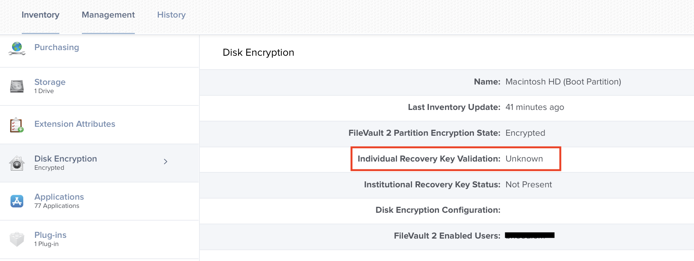

# Manually Remediate the Ivalid or Unknown Personal FileVault Recovery Key Issue in Jamf Pro

## Issue

Sometimes Jamf will report that a FileVault recovery key is invalid or unkown on a Mac. This prevents and end-user from being able to use their recovery key if their login password is forgotten. (see screenshot below) The good news is that the disk is still encrypted. 😅

This is a workflow that can be used to manually 

## Steps

1. Shutdown the Mac.
2. Press the power button. Then, immediately press and hold the following keyboard combination to boot to **Internet Recovery**.

    **⌘ + R**
    
3. If a **Firmware** password prompt is shown enter the require password.

### Basic Steps

1. Boot to recovery ⌘ + R
1. Enter firmware password
1. Once in internet recovery select tools from the menu bar the select Terminal.app
1. enter resetpassword
1. Select the account
1. Select either can't remember password or password is not working at the login window.
1. Reset the password
1. Restart the mac
1. At the filevault login window should be able to use the password that was just reset
1. At the Mac login window you will need to login with trustedadvisor
1. Reset the user's password from System preferences
1. Logout 
1. Login with the password that you reset with the trusted advisor user
1. Connect to GP
1. Connect to EC so that the local and netowrk passwords can be synced
